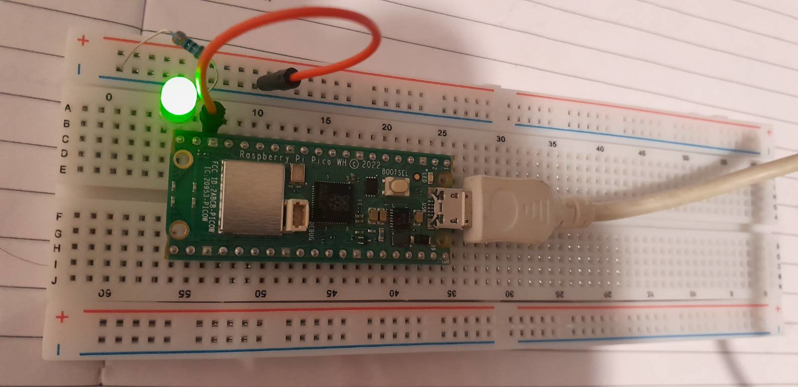

# PI pico blink demo



Blink demo taken from https://github.com/raspberrypi/pico-examples 
and make it compile on its own.

Here is a guide which walks you through setting up the Raspberry Pi Pico SDK on a Linux system without any GUI such as vscode.

## Step 1: Install Required Dependencies
Open a terminal and install the necessary tools:

```bash
sudo apt update && sudo apt install -y cmake gcc-arm-none-eabi libnewlib-arm-none-eabi build-essential git
```

## Step 2: Clone the Pico SDK
Navigate to a workspace directory and clone the official Raspberry Pi Pico SDK:

```bash
mkdir -p ~/pico && cd ~/pico
git clone https://github.com/raspberrypi/pico-sdk.git
cd pico-sdk
git checkout tags/2.2.0 -b sdk2.2.0
git submodule update --init
```

## Step 3: Set Up Environment Variables
To ensure the build system finds the SDK, set an environment variable:

```bash
echo 'export PICO_SDK_PATH=~/pico/pico-sdk' >> ~/.bashrc
source ~/.bashrc
```

Now, configure the project with CMake:

```bash
cmake .
```

## Step 5: Compile the Code
Compile the program

```bash
make
```

If successful, this will generate a `blink.uf2`.

## Step 6: Flash the Firmware
To flash the firmware to your Pico:

1. Hold down the **BOOTSEL** button on the Pico.
2. Plug it into your computer via USB then release **BOOTSEL**.
3. The Pico should appear as a mass storage device (`RPI-RP2`).
4. Copy the `blink.uf2` file to the Pico:

   ```bash
   cp blink.uf2 /media/$USER/RPI-RP2/
   ```

The Pico will automatically reboot and start running the Blink program.

Credit:
https://github.com/clockworkpi/PicoCalc/blob/master/wiki/Setting-Up-the-Pico-SDK-on-Linux-for-Pico-Development.md
